# Diagramas de Flujo - To-Do App

## 📋 Descripción

Este documento contiene diagramas de flujo en Mermaid que visualizan la interacción entre Usuario, Frontend, Backend y Base de Datos en la aplicación To-Do.

## IMPORTANTE

Para ver los diagramas, se debe tener instalado el plugin de Mermaid en el IDE.
[Mermaid Chart Extension](https://marketplace.cursorapi.com/items/?itemName=MermaidChart.vscode-mermaid-chart)

## 🏗️ Arquitectura General del Sistema

```mermaid
graph TB
    subgraph "Capa de Presentación"
        UI[Usuario]
        FE[Frontend<br/>Next.js<br/>Port: 3000]
    end

    subgraph "Capa de API"
        BE[Backend<br/>Django REST<br/>Port: 8000]
    end

    subgraph "Capa de Datos"
        DB[(PostgreSQL<br/>Port: 5432)]
    end

    UI <-->|Interacción| FE
    FE <-->|HTTP/HTTPS| BE
    BE <-->|SQL| DB

    style UI fill:#e1f5fe
    style FE fill:#f3e5f5
    style BE fill:#e8f5e8
    style DB fill:#fff3e0
```



## 🔐 Flujo de Autenticación

### 1. Registro de Usuario

```mermaid
flowchart TD
    A[Usuario accede a registro] --> B[Frontend: Mostrar formulario]
    B --> C[Usuario llena datos]
    C --> D{Validar datos en Frontend}
    D -->|Válidos| E[Enviar POST /api/auth/register/]
    D -->|Inválidos| F[Mostrar errores]
    F --> C

    E --> G[Backend: Validar datos]
    G --> H{Username único?}
    H -->|No| I[Retornar error: Usuario existe]
    H -->|Sí| J{Email único?}
    J -->|No| K[Retornar error: Email existe]
    J -->|Sí| L[Crear usuario en DB]

    L --> M[Generar tokens JWT]
    M --> N[Retornar tokens y usuario]
    N --> O[Frontend: Guardar token]
    O --> P[Redirigir a página de tareas]

    I --> C
    K --> C

    style A fill:#e1f5fe
    style B fill:#f3e5f5
    style E fill:#f3e5f5
    style G fill:#e8f5e8
    style L fill:#fff3e0
    style O fill:#f3e5f5
```



### 2. Inicio de Sesión

```mermaid
flowchart TD
    A[Usuario accede a login] --> B[Frontend: Mostrar formulario]
    B --> C[Usuario ingresa credenciales]
    C --> D{Validar datos en Frontend}
    D -->|Válidos| E[Enviar POST /api/auth/login/]
    D -->|Inválidos| F[Mostrar errores]
    F --> C

    E --> G[Backend: Verificar credenciales]
    G --> H{Usuario existe?}
    H -->|No| I[Retornar error: Credenciales inválidas]
    H -->|Sí| J{Password correcta?}
    J -->|No| I
    J -->|Sí| K[Obtener usuario de DB]

    K --> L[Generar tokens JWT]
    L --> M[Retornar tokens y usuario]
    M --> N[Frontend: Guardar token]
    N --> O[Redirigir a página de tareas]

    I --> C

    style A fill:#e1f5fe
    style B fill:#f3e5f5
    style E fill:#f3e5f5
    style G fill:#e8f5e8
    style K fill:#fff3e0
    style N fill:#f3e5f5
```



## 📝 Flujo de Gestión de Tareas

### 1. Listar Tareas

```mermaid
flowchart TD
    A[Usuario accede a tareas] --> B[Frontend: Verificar token]
    B --> C{Token válido?}
    C -->|No| D[Redirigir a login]
    C -->|Sí| E[Enviar GET /api/tasks/]

    E --> F[Backend: Verificar token JWT]
    F --> G{Token válido?}
    G -->|No| H[Retornar 401: Token inválido]
    G -->|Sí| I[Obtener usuario del token]

    I --> J[Consultar tareas en DB]
    J --> K[Retornar lista de tareas]
    K --> L[Frontend: Mostrar tareas]

    H --> D

    style A fill:#e1f5fe
    style B fill:#f3e5f5
    style E fill:#f3e5f5
    style F fill:#e8f5e8
    style J fill:#fff3e0
    style L fill:#f3e5f5
```



### 2. Crear Nueva Tarea


### 3. Ver Detalle de Tarea

```mermaid
flowchart TD
    A[Usuario hace clic en tarea] --> B[Frontend: Verificar token]
    B --> C{Token válido?}
    C -->|No| D[Redirigir a login]
    C -->|Sí| E[Enviar GET /api/tasks/{id}/]

    E --> F[Backend: Verificar token JWT]
    F --> G{Token válido?}
    G -->|No| H[Retornar 401: Token inválido]
    G -->|Sí| I[Obtener usuario del token]

    I --> J[Obtener tarea de DB]
    J --> K{Tarea existe?}
    K -->|No| L[Retornar 404: Tarea no encontrada]
    K -->|Sí| M{Tarea pertenece al usuario?}

    M -->|No| N[Retornar 403: Acceso denegado]
    M -->|Sí| O[Retornar detalles de tarea]
    O --> P[Frontend: Mostrar detalles]

    H --> D
    L --> D
    N --> D

    style A fill:#e1f5fe
    style B fill:#f3e5f5
    style E fill:#f3e5f5
    style F fill:#e8f5e8
    style J fill:#fff3e0
    style P fill:#f3e5f5
```

### 4. Actualizar Tarea

```mermaid
flowchart TD
    A[Usuario edita tarea] --> B[Frontend: Mostrar formulario]
    B --> C[Usuario modifica datos]
    C --> D{Validar datos en Frontend}
    D -->|Válidos| E[Enviar PUT /api/tasks/{id}/]
    D -->|Inválidos| F[Mostrar errores]
    F --> C

    E --> G[Backend: Verificar token JWT]
    G --> H{Token válido?}
    H -->|No| I[Retornar 401: Token inválido]
    H -->|Sí| J[Obtener usuario del token]

    J --> K[Obtener tarea de DB]
    K --> L{Tarea existe?}
    L -->|No| M[Retornar 404: Tarea no encontrada]
    L -->|Sí| N{Tarea pertenece al usuario?}

    N -->|No| O[Retornar 403: Acceso denegado]
    N -->|Sí| P{Validar datos de actualización}
    P -->|Inválidos| Q[Retornar error: Datos inválidos]
    P -->|Válidos| R[Actualizar tarea en DB]

    R --> S[Retornar tarea actualizada]
    S --> T[Frontend: Mostrar confirmación]
    T --> U[Actualizar vista de tarea]

    I --> C
    M --> C
    O --> C
    Q --> C

    style A fill:#e1f5fe
    style B fill:#f3e5f5
    style E fill:#f3e5f5
    style G fill:#e8f5e8
    style R fill:#fff3e0
    style T fill:#f3e5f5
```

### 5. Marcar Tarea como Completada

```mermaid
flowchart TD
    A[Usuario hace clic en Completar] --> B[Frontend: Verificar token]
    B --> C{Token válido?}
    C -->|No| D[Redirigir a login]
    C -->|Sí| E[Enviar PATCH /api/tasks/{id}/]

    E --> F[Backend: Verificar token JWT]
    F --> G{Token válido?}
    G -->|No| H[Retornar 401: Token inválido]
    G -->|Sí| I[Obtener usuario del token]

    I --> J[Obtener tarea de DB]
    J --> K{Tarea existe?}
    K -->|No| L[Retornar 404: Tarea no encontrada]
    K -->|Sí| M{Tarea pertenece al usuario?}

    M -->|No| N[Retornar 403: Acceso denegado]
    M -->|Sí| O[Actualizar estado a 'done' en DB]

    O --> P[Retornar tarea actualizada]
    P --> Q[Frontend: Mostrar confirmación]
    Q --> R[Actualizar estado en interfaz]

    H --> D
    L --> D
    N --> D

    style A fill:#e1f5fe
    style B fill:#f3e5f5
    style E fill:#f3e5f5
    style F fill:#e8f5e8
    style O fill:#fff3e0
    style Q fill:#f3e5f5
```

### 6. Eliminar Tarea

```mermaid
flowchart TD
    A[Usuario hace clic en Eliminar] --> B[Frontend: Mostrar confirmación]
    B --> C{Usuario confirma?}
    C -->|No| D[Cancelar operación]
    C -->|Sí| E[Verificar token]

    E --> F{Token válido?}
    F -->|No| G[Redirigir a login]
    F -->|Sí| H[Enviar DELETE /api/tasks/{id}/]

    H --> I[Backend: Verificar token JWT]
    I --> J{Token válido?}
    J -->|No| K[Retornar 401: Token inválido]
    J -->|Sí| L[Obtener usuario del token]

    L --> M[Obtener tarea de DB]
    M --> N{Tarea existe?}
    N -->|No| O[Retornar 404: Tarea no encontrada]
    N -->|Sí| P{Tarea pertenece al usuario?}

    P -->|No| Q[Retornar 403: Acceso denegado]
    P -->|Sí| R[Eliminar tarea de DB]

    R --> S[Retornar confirmación de eliminación]
    S --> T[Frontend: Mostrar confirmación]
    T --> U[Actualizar lista de tareas]

    K --> G
    O --> G
    Q --> G

    style A fill:#e1f5fe
    style B fill:#f3e5f5
    style H fill:#f3e5f5
    style I fill:#e8f5e8
    style R fill:#fff3e0
    style T fill:#f3e5f5
```

## 🔍 Flujo de Filtrado

### Filtrar Tareas por Estado

```mermaid
flowchart TD
    A[Usuario selecciona filtro] --> B[Frontend: Verificar token]
    B --> C{Token válido?}
    C -->|No| D[Redirigir a login]
    C -->|Sí| E[Enviar GET /api/tasks/?status={filter}]

    E --> F[Backend: Verificar token JWT]
    F --> G{Token válido?}
    G -->|No| H[Retornar 401: Token inválido]
    G -->|Sí| I[Obtener usuario del token]

    I --> J[Consultar tareas filtradas en DB]
    J --> K[Retornar tareas filtradas]
    K --> L[Frontend: Mostrar tareas filtradas]

    H --> D

    style A fill:#e1f5fe
    style B fill:#f3e5f5
    style E fill:#f3e5f5
    style F fill:#e8f5e8
    style J fill:#fff3e0
    style L fill:#f3e5f5
```

## 🚪 Flujo de Cierre de Sesión

```mermaid
flowchart TD
    A[Usuario hace clic en Logout] --> B[Frontend: Eliminar token]
    B --> C[Limpiar headers de autorización]
    C --> D[Redirigir a página de login]

    E[Opcional: Enviar POST /api/auth/logout/] --> F[Backend: Verificar token]
    F --> G{Token válido?}
    G -->|No| H[Retornar 401: Token inválido]
    G -->|Sí| I[Agregar token a lista negra]
    I --> J[Retornar confirmación de logout]

    style A fill:#e1f5fe
    style B fill:#f3e5f5
    style D fill:#f3e5f5
    style F fill:#e8f5e8
    style I fill:#e8f5e8
```



## ⚠️ Flujo de Manejo de Errores

```mermaid
flowchart TD
    A[Error en petición] --> B[Frontend: Interceptar error]
    B --> C{Verificar código de error}

    C -->|401| D[Mostrar: Sesión expirada]
    D --> E[Redirigir a login]

    C -->|403| F[Mostrar: Acceso denegado]

    C -->|404| G[Mostrar: Recurso no encontrado]

    C -->|500| H[Mostrar: Error del servidor]

    C -->|Otro| I[Mostrar: Error inesperado]

    F --> J[Permitir reintentar]
    G --> J
    H --> J
    I --> J

    style A fill:#ffebee
    style B fill:#f3e5f5
    style D fill:#ffebee
    style F fill:#ffebee
    style G fill:#ffebee
    style H fill:#ffebee
    style I fill:#ffebee
```



## 🔄 Flujo Completo de Usuario

```mermaid
flowchart TD
    A[Usuario nuevo] --> B[Registrarse]
    B --> C[Iniciar sesión]
    C --> D[Acceder a tareas]
    D --> E[Crear tarea]
    E --> F[Ver tareas]
    F --> G[Editar tarea]
    G --> H[Marcar como completada]
    H --> I[Filtrar tareas]
    I --> J[Cerrar sesión]

    subgraph "Ciclo de Gestión"
        E
        F
        G
        H
        I
    end

    I --> E

    style A fill:#e1f5fe
    style B fill:#e8f5e8
    style C fill:#e8f5e8
    style D fill:#f3e5f5
    style E fill:#fff3e0
    style F fill:#fff3e0
    style G fill:#fff3e0
    style H fill:#fff3e0
    style I fill:#fff3e0
    style J fill:#ffebee
```



## 🔒 Flujo de Validación de Seguridad


## 📊 Flujo de Optimización y Caching

```mermaid
flowchart TD
    A[Petición de datos] --> B[Frontend: Verificar cache local]
    B --> C{Datos en cache?}
    C -->|Sí| D{Cache válido?}
    C -->|No| E[Enviar petición al backend]

    D -->|Sí| F[Retornar datos del cache]
    D -->|No| E

    E --> G[Backend: Procesar petición]
    G --> H[Consultar base de datos]
    H --> I[Retornar datos]
    I --> J[Frontend: Guardar en cache]
    J --> K[Mostrar datos]

    F --> K

    style A fill:#e1f5fe
    style B fill:#f3e5f5
    style F fill:#e8f5e8
    style E fill:#f3e5f5
    style G fill:#e8f5e8
    style H fill:#fff3e0
    style J fill:#f3e5f5
    style K fill:#f3e5f5
```



---

**Nota**: Estos diagramas visualizan los flujos descritos en el pseudocódigo, mostrando la interacción entre las diferentes capas del sistema y los puntos de validación y manejo de errores.
